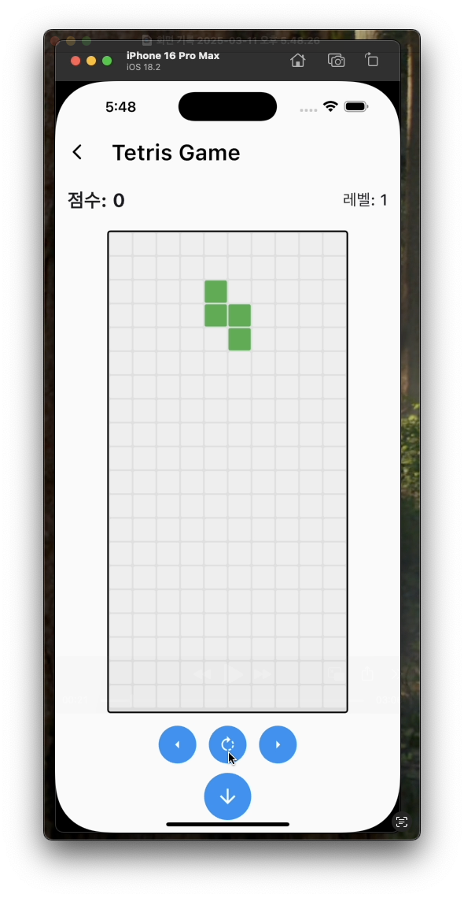

# BlockPuzzle

**BlockPuzzle**는 Flutter를 사용하여 개발된 모바일 애플리케이션으로, 클래식 테트리스 게임 경험을 제공하며, 플레이어 프로필, 리더보드, 사용자 맞춤 설정과 같은 현대적인 기능을 포함합니다. 이 앱은 깔끔한 디자인, 직관적인 사용자 인터랙션, 그리고 원활한 성능에 중점을 두고 개발되었습니다.

## 주요 기능

- **로그인 화면**: 사용자 ID를 입력하여 간단하고 안전하게 로그인할 수 있습니다.
- **홈 화면**: 플레이어 프로필, 최근 플레이 기록을 표시하며, 게임 시작 또는 랜덤 블록 미리보기 옵션을 제공합니다.
- **게임 화면**: 부드러운 컨트롤과 실시간 점수 추적 기능을 갖춘 클래식 테트리스 게임플레이를 지원합니다.
- **게임 오버 화면**: 최종 점수와 총 점수를 표시하며, 홈 화면으로 돌아갈 수 있는 버튼을 제공합니다.
- **플레이어 통계**: 개인 랭킹 기록과 업적을 확인할 수 있습니다.
- **리더보드**: 전체 플레이어 순위를 확인하고, 순위를 업데이트하거나 닫을 수 있는 기능을 제공합니다.
- **설정**: 게임 컨트롤, 소리, 테마(라이트/다크 모드)를 커스터마이징할 수 있습니다.
- **다국어 지원**: 주로 한국어로 제공되며, 추가 언어 지원 가능성을 열어둡니다.

## 스크린샷

아래는 앱의 주요 화면에 대한 스크린샷입니다:

- **로그인 화면**  
  

- **홈 화면**  
  

- **게임 화면**  
  

- **게임 오버 화면**  
  

- **리더보드**  
  

## 설치 방법

BlockPuzzle  앱을 로컬에서 실행하려면 다음 단계를 따르세요:

1. **저장소 복제**:

   ```bash
   git clone https://github.com/chjcmy/BlockPuzzle.git
   cd BlockPuzzle
   ```

2. **종속성 설치**:
   Flutter가 설치되어 있는지 확인한 후, 다음 명령어를 실행하세요:

   ```bash
   flutter pub get
   ```

3. **앱 실행**:
   디바이스를 연결하거나 에뮬레이터를 시작한 후, 다음 명령어를 실행하세요:

   ```bash
   flutter run
   ```

## 사용 가이드

1. **로그인**:
    - ID 입력란에 사용자 ID를 입력하고 "확인" 버튼을 눌러 홈 화면으로 이동하세요.

2. **홈 화면**:
    - 플레이어 프로필과 최근 플레이 기록을 확인하세요.
    - "시작하기" 버튼을 눌러 새 게임을 시작하거나, "랜덤 블록" 버튼으로 테트리스 블록을 미리 볼 수 있습니다.

3. **게임플레이**:
    - 화면의 조이스틱 아이콘을 사용해 테트리스 블록을 이동하고 회전시키세요.
    - 라인을 지워 높은 점수를 목표로 하세요.

4. **게임 오버**:
    - 게임이 종료되면 최종 점수와 총 점수를 확인하세요.

5. **리더보드**:
    - 개인 랭킹과 전체 플레이어 순위를 확인하세요.

## 프로젝트 구조

프로젝트는 다음과 같이 구성되어 있습니다:

```
lib/
├── main.dart               # 앱의 진입점
├── src/
│   ├── model/              # 데이터 모델
│   │   ├── piece.dart      # 테트리스 블록 모델
│   │   ├── user.dart       # 사용자 모델
│   │   └── score.dart      # 점수 모델
│   ├── view/               # UI 화면 및 컴포넌트
│       ├── login/          # 로그인 화면
│       │   └── login_view.dart
│       ├── home/           # 홈 화면
│       │   └── home_view.dart
│       ├── game/           # 게임 화면
│       │   └── game_view.dart
│       ├── game_over/      # 게임 오버 화면
│       │   └── game_over_view.dart
│       └── leaderboard/    # 리더보드 화면
│           └── leaderboard_view.dart
└── theme/                  # 테마 관련 파일
    ├── light_theme.dart    # 라이트 테마
    └── dark_theme.dart     # 다크 테마
```

- **`model/`**: `Piece`, `User`, `Score`와 같은 데이터 모델을 정의합니다.
- **`view/`**: 각 화면(로그인, 홈, 게임 등)에 대한 UI 컴포넌트를 포함합니다.
- **`theme/`**: 라이트 및 다크 테마를 정의하여 앱의 외관을 커스터마이징합니다.
